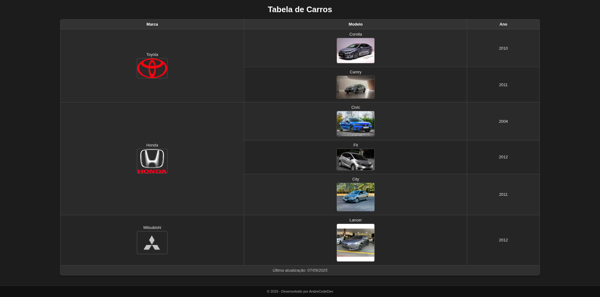

# 📘 Atividade Prática – Front-End | Tabela e Imagens em HTML

**Disciplina:** Linguagens de Programação – AS009TSN1  
**Tema:** Estruturação de Tabela e Uso de Imagens em HTML  
**Prazo de Entrega:** 27/08/2025  

---

## 🧑‍💻 Descrição da Atividade

Este projeto é parte da atividade prática da disciplina de Linguagens de Programação e tem como objetivo trabalhar a criação de tabelas no **HTML5**, explorando a correta estruturação com **thead**, **tbody** e **tfoot**, além da inclusão de imagens para ilustrar os elementos apresentados.

A proposta é criar um arquivo chamado **`tabela.html`** que contenha uma tabela de marcas, modelos e anos de carros, incluindo imagens representativas para cada marca.

---

## 📝 Requisitos Atendidos

- ✅ Estruturação da tabela utilizando as tags:  
  `<table>`, `<thead>`, `<tbody>`, `<tr>`, `<th>`, `<td>` e `<tfoot>`.  
- ✅ Inclusão das colunas **Marca**, **Modelo** e **Ano** com os seguintes dados:  
  - Toyota → Corolla (2010) e Camry (2011)  
  - Honda → Civic (2004), Fit (2012) e City (2011)  
  - Mitsubishi → Lancer (2012)  
- ✅ Uso de imagens para cada marca de carro (armazenadas na pasta `img/`).  
- ✅ Rodapé da tabela com a frase:  
  “Última atualização: 27/08/2025”.  
- ✅ Organização e indentação do código HTML.  

---

## 📂 Estrutura de Pastas 

projeto-tabela-carros/
├── html/
│ └── tabela.html
├── img/
│ ├── toyota.jpg
│ ├── corolla.jpg
│ ├── camry.jpg
│ ├── honda.jpg
│ ├── civic.jpg
│ ├── fit.jpg
│ ├── city.jpg
│ ├── mitsubishi.jpg
│ ├── previa_readme.jpg
│ └── lancer.jpg
└── README.md

---

## 💡 O que foi aprendido

Durante a construção deste projeto, foram aplicados e compreendidos os seguintes conceitos:

- Estruturação de tabelas em HTML.  
- Diferença entre `<thead>`, `<tbody>` e `<tfoot>`.  
- Inserção de imagens com atributos `src`, `alt` e `width/height`.  
- Organização de arquivos em pastas.  
- Escrita de código HTML identado e semântico.  

---

## ✅ Tecnologias Utilizadas

- HTML5  

---

## 📸 Prévia do Projeto

> *Exemplo de visualização da tabela com imagens*  

---

## 📎 Autor

Desenvolvido por **André Vitor – ANDRECODEDEV** 👨‍💻  
Turma: **AS009TSN1**  
